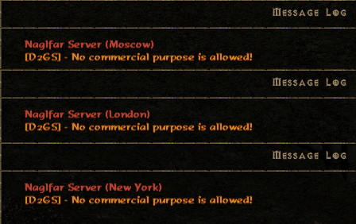


  

Step 1

Install Diablo II and Lord of Destruction Expansion.

Step 2

Our server requires version 1.14d. If you already have 1.14d, then just skip further to step 3. 
If you have version 1.13d or less - you got two options:  
<em>Option #1</em>  
Our server has auto-update till version 1.14d. So you can just download our <a href="https://drive.google.com/uc?authuser=0&amp;id=1uiEPp6MkNFN3Tj_ZjnZ2c4seVwEcfrgE&amp;export=download" target="_blank" rel="noopener noreferrer">reg file</a>. Add the server's info to the registry. Launch game (<em>close all other d2 windows before that</em>) as Administrator (<em>if you won't do that, the update might crash and the message will say "unable to identify application version" - watch <a href="#ref1">ref #1</a> in that case</em>) and connect to Asgard. The game will be updated till 1.14d.  
Now you can skip further&nbsp;to step 4.  
<em>Option #2</em>  
Install the patch manually. Download official <a href="http://ftp.blizzard.com/pub/diablo2exp/patches/PC/LODPatch_114d.exe" target="_blank" rel="noopener noreferrer">patch 1.14d</a>. Run it. If the update was successful, skip till step 3. 
The problem might appear if you have multiple folders of Diablo II. The patch might start installing into the wrong folder. To avoid that, you need to download <a href="https://drive.google.com/uc?authuser=0&amp;id=1bcOCMcdadPi_ff05wLMpnTUAUDVg_4TN&amp;export=download" target="_blank" rel="noopener noreferrer">LodRepair.exe</a>. Run it. Choose your game folder and push "Apply Path" button. Now any patch will be installed into the folder you just chose. Install <a href="http://ftp.blizzard.com/pub/diablo2exp/patches/PC/LODPatch_114d.exe" target="_blank" rel="noopener noreferrer">patch 1.14d</a> again.  
If you still have a problem (<em>invalid game version</em>) - watch <a href="#ref1">ref #1</a>

Step 3

Download <a href="https://drive.google.com/uc?authuser=0&amp;id=1uiEPp6MkNFN3Tj_ZjnZ2c4seVwEcfrgE&amp;export=download" target="_blank" rel="noopener noreferrer">reg file</a>. 
<em>(<a href="https://drive.google.com/uc?authuser=0&amp;id=1AFhantad_4D5-2bvLeyUoxmbuKqDLCHF&amp;export=download" target="_blank" rel="noopener noreferrer">this one</a>&lt;---- for Russian players)</em> 
Double click it. Add the server's gateway into the registry. 
If you are using Battle.net Gateway Editor:
IP Address: bnet.minimoo.eu 
Zone: 8 
If you have done everything right, Asgard will appear in the list of your servers and you will be able to easily swap between Eu/East and Asgard.  

Step 4

Create game account via the <a style="color: #0000ff; text-decoration: underline;" href="/create-account" target="_blank" rel="alternate noopener noreferrer">web link</a> 
<h2> Account registration through the game client is disabled!</h2> 

<em>Remember, that your password should be maximum 12 symbols long! 
Sometimes there is a bug when the password you chose will appear incorrect when trying to enter it in the game (usually happens when your password contains symbols other than Latin letters or numbers). <a href="/contacts" target="_blank" rel="alternate noopener noreferrer">Contact</a> us and we will fix it.</em>

Step 5

Connect to the server and choose Asgard realm from the list of realms (<em>upper right corner of characters menu</em>).

Step 6

Our server has three hosts:

<ul>
<li>Moscow</li>
<li>London</li>
<li>New York</li>
</ul>
 
The message of the day names the host&nbsp;where the game is created. Keep creating games until it is the server you want. Usually takes 3-4 tries.

Step 7

Create your character, make items via <a href="/cube-recipes" target="_blank" rel="noopener noreferrer">cube recipes</a> or <a href="/mod-info" target="_blank" rel="noopener noreferrer">in-game accounts</a>. Enjoy your duels!

~
~
~

ref #1

If you are having any problems with your game's version (<em>invalid game version</em>) install <a href="https://drive.google.com/uc?authuser=0&amp;id=1bcOCMcdadPi_ff05wLMpnTUAUDVg_4TN&amp;export=download" target="_blank" rel="noopener noreferrer">LodRepair.exe</a>. Run it. Choose your game folder. Push the "Apply path" button. Push "Start Update". This will reset your game's version to clear 1.07(<em>iirc</em>). After that install <a href="http://ftp.blizzard.com/pub/diablo2exp/patches/PC/LODPatch_114d.exe" target="_blank" rel="noopener noreferrer">patch 1.14d</a> again.
 
If you are somehow still having problems with your game's version - that means something is basically wrong with your Diablo 2 game files. You better just re-install it.

