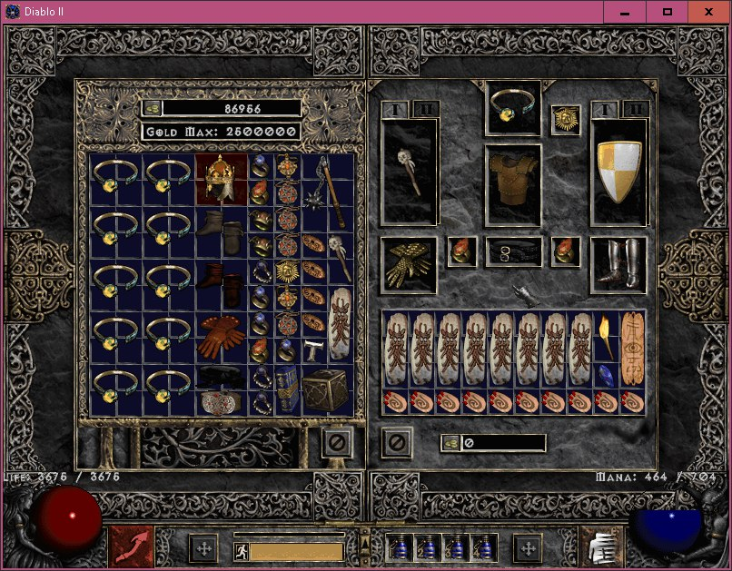
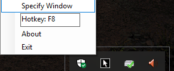



 <h1> Pay attention! 
Normal's penalties are the same as in Hell (-100 all res).  
However, they aren't shown correctly (visual bug), so you need to count them manually.</h1>  
To avoid this you can download a mini-mod - watch the bottom of this page  
<b>Ladder</b> features legit items only. 
<b>Non-Ladder</b> features bugged items, hybrid runewords, 08 items.  
Our server also features <b>Low-Level Dueling (30 lvl)</b>. If you want to make an lld character — contact one of the moderators in game. 
If some of you want to see <b>8/49/60 Level Dueling</b> on our server and ready to put your energy in it <em>(create a massive list of all needed items)</em> - <a href="https://asgardpvp.win/contacts" rel="alternate">contact</a> us.
  
Ladder in-game accounts: *items, *chars, *chars_fpk, *chars_fpk1, *chars_mirror, *chars_mirror1,&nbsp;*chars_block (also *items_lld, *chars_lld, *chars_lld1) 
Non-Ladder in-game accounts: *items_nl, *chars_nl, *chars_nl1 
Password to all accounts:<b>asgard</b>  
All items and characters respawn every 2 hours. 
 
Changes: 
<ul>
<li>Every char starts with 99 lvl and completed quests <em>(+505 stats, +110 skill points, +60 hp from Alkor, +30 all res from Anya)</em></li> 
<li>Horadric Cube, class Hellfire Torch and Anihillus in inventory at the start</li> 
<li>Monsters and Shrines removed from &nbsp;Blood Moor location</li> 
<li>All spawned items have perfect stats, prefixes, and&nbsp;suffixes</li> 
<li>Dsabled "non-pvp" affixes to appear on generated items <em>_like +% Magic Find, Gold Find)</em></li> 
<li>Added new <a href="https://asgardpvp.win/cube-recipes" rel="alternate">Horadric Cube recipes</a></li> 
<li>NPC sell items of any kind</li> 
<li>All items have 1 gold price <em>(if shows more - visual bug)</em></li> 
<li>You only need gem for crafting</li> 
<li>Claw golem's slow is nerfed to 10% to balance a Necromancer <em>(can be discussed and returned to the original)</em></li> 
</ul>

<h2>For regular players</h2>

<em>(optional)</em>

<h3>Mini-mod</h3>

 Above all, you can install our <a href="https://drive.google.com/open?id=1kkE-i3MPE_R1qbF1K7XPgY7FZjG0A_Pe" target="_blank" rel="noopener noreferrer">mini-mod</a>. You better create a special folder just for Asgard in that case. It allows you to tp, bo, bc in town (for convenience), increases stash. It also correctly shows your resistances in Normal difficulty (Normal resistances are same as in Hell, but they are messy without this mini-mod - you need to count it manually).< 
If you will accidentally connect to other servers with this mini-mod - it will show resistances and Vendors' prices incorrectly, show fake-increased stash.

<h3> Multi-loader</h3>

In order to run multiple windows of Diablo 2 you can download our <a href="https://drive.google.com/open?id=1jRjKdWPwPLWx5hG4q5WtDGoMhaw6jmO9" target="_blank" rel="alternate noopener noreferrer">multi-loader</a>. It's made especially for Asgard so it works only on our server. Make sure to follow instructions in Readme.txt.

<h3>Cursor Locker</h3>

To avoid your cursor being pushed out of your window you can download simple and easy cursor locker called <a href="http://www.dota-utilities.com/2008/11/downloads-warcraft-iiiwindows-mouse.html" target="_blank" rel="alternate noopener noreferrer">WMC</a> 
Run it (better as Administrator). Right-click it.
 

 
Choose Hotkey. Push Specify Window and click your Diablo 2 window. Press chosen hotkey.
Another option is <a href="https://www.techspot.com/downloads/7061-borderless-gaming.html" rel="alternate">Borderless Gaming</a>. It is little harder to configure but the right side won't be bugged when trying to <a href="https://asgardpvp.win/guides/ct-trick" target="_blank" rel="alternate noopener noreferrer">C/T</a>.

<h3>Auto Town portal on death</h3>

You can make it so every time you die a Town portal will cast automatically. In order to do this, you need to put your Annihilus in the cube and transmute it (with nothing). Affix "100% to cast level 1 Tom of Townportal when you die" will appear. After that put Tome of Townportal in Stash (or Cube that is in Stash).  
Now you can get back to your corpse immediately after your death by clicking on Town portal. Unfortunately, the mechanic is similar to the Life Tap's "on striking", so if you will die while WW - it won't appear.

<h3>Auto-reroller</h3>

If you are tired of the manual-rerolling item with needed affixes you can download <a href="https://drive.google.com/open?id=1u4m6qcYRDLXXiQg9hQHZ98pc48Pf6C1q" target="_blank" rel="alternate noopener noreferrer">item's auto-reroller</a>(aka Tokenhack) (c).
What you do is you start it, open configure file and write down needed affixes. Then you enter the game, point your cursor on the item and press the chosen key for auto-reroll. It will reroll an item until it gets what you chose.

Some AV soft detects it as a virus (cause it roots right into Game.exe), so you might have to add it to AV's exception list.

